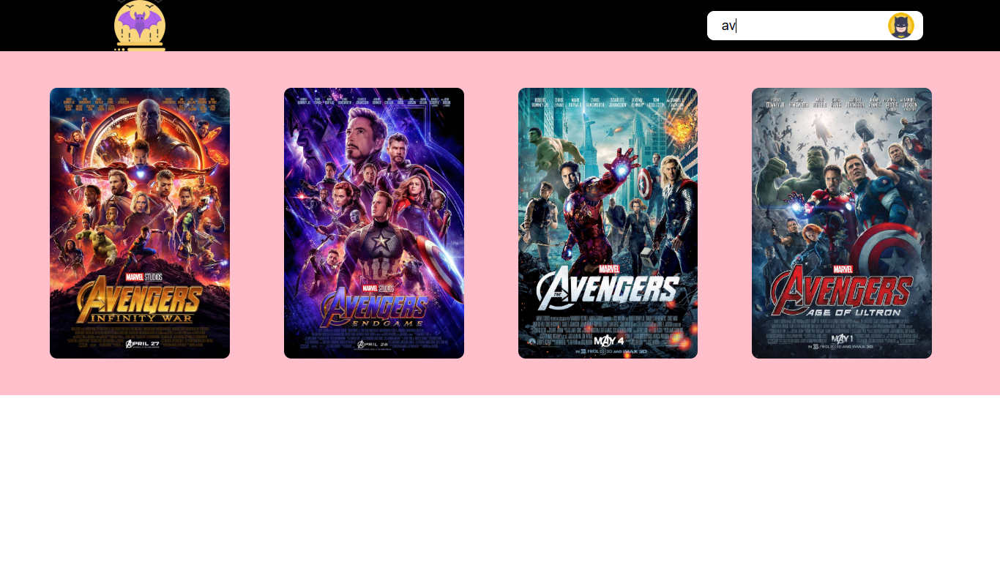

# 🎬 Netflix UI Clone (Frontend)

## 📌 Overview
This project is a **frontend clone of Netflix UI** built using HTML, CSS, and JavaScript.

It focuses on creating an interactive user interface with dynamic behavior such as search functionality and hover-based details.

---

## 🎯 Features
- Responsive UI inspired by Netflix  
- Movie cards with posters  
- Hover effects to display additional details  
- Search functionality to filter movies  
- Clean and structured layout  

---

## 🧠 Key Concepts Used
- DOM manipulation (JavaScript)  
- Event handling  
- Search filtering logic  
- CSS styling and layout design  

---

## 🛠 Tech Stack
- HTML  
- CSS  
- JavaScript  

---

## 📂 Project Structure
- index.html
- style.css
- script.js

---

## 🔍 How It Works
- Movies are displayed as cards  
- On hover → additional details are shown  
- Search bar → filters movies dynamically based on input  

---

## 📸 Output

| Home Page | Search Feature |
|----------|---------------|
|  |  |

---

## ⚠️ Limitations
- No backend integration  
- Does not stream videos  
- Static dataset  

---

## 🚀 Future Improvements
- Add backend (Node.js / Firebase)  
- Enable real-time movie API (TMDB)  
- Add user authentication  
- Enable video playback  

---

## ⭐ Conclusion
This project demonstrates frontend development skills including UI design, interactivity, and dynamic behavior using JavaScript.
